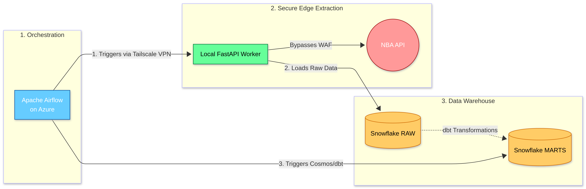
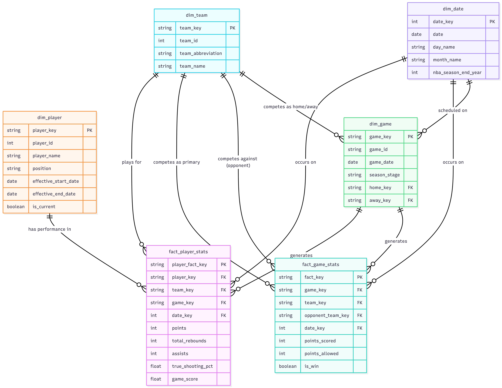

# NBA Analytics Data Pipeline


## Project Overview
This project is an end-to-end, automated ELT (Extract, Load, Transform) pipeline designed to extract comprehensive player and game statistics from the official NBA API, load the raw data into a Snowflake data warehouse and transform it into a dimensional model for analytics.

## System Architecture
**Pipeline Architecture**
 

**Data Model**


### The Tech Stack
* **Orchestration:** Apache Airflow (Dockerized on Azure VM)
* **Extraction Worker:** FastAPI, Uvicorn, Python `nba_api`(Running as a `systemd` background service)
* **Secure Networking:** Tailscale (Zero-Trust Mesh VPN)
* **Data Warehouse:** Snowflake
* **Transformation:** dbt (Data Build Tool) integrated via Astronomer Cosmos

## Repository Structure
```text
NBA-Analytics-Pipeline/
├── airflow/                             # Orchestration
│   └── dags/
│       ├── config.py
│       └── nba_analytics_pipeline.py    # Airflow DAG defining the ELT flow
├── docs/                                # Project documentation & images
│   ├── data_model_diagram.png
│   └── pipeline_diagram.png
├── extraction/                          # Local Python Extraction Scripts
│   ├── config.py
│   ├── game_logs.py
│   ├── player_info.py
│   ├── team_rosters.py
│   └── utils.py
├── nba_analytics/                       # dbt Project (Transformations)
│   ├── dbt_project.yml
│   ├── macros/
│   ├── models/
│   │   ├── staging/                     # Base views on top of RAW Snowflake tables
│   │   ├── intermediate/                # Joins and business logic
│   │   └── marts/                       # Materialized dimensional models
│   └── tests/                           # Custom dbt data quality tests
├── sql/                                 # Snowflake setup & test scripts
│   ├── snowflake_database_schema.sql
│   ├── snowflake_raw_setup.sql
│   └── snowflake_warehouse.sql
├── test/                                # API Verification scripts
│   └── verify_api.py
├── api.py                               # FastAPI script for remote triggering
├── Dockerfile                           # Custom Airflow image with Cosmos dependencies
├── requirements.txt
└── README.md
```
## Pipeline Execution Flow

1. **Scheduled Trigger:** Airflow, running on the Azure VM, triggers the daily `nba_analytics_pipeline` DAG.
2. **Secure Remote Control:** Airflow utilizes a `SimpleHttpOperator` to send an HTTP POST request across the Tailscale private network (`100.x.x.x:8000`) to the local FastAPI worker.
3. **WAF Bypass & Extraction:** The local Ubuntu worker receives the command and initiates the Python extraction scripts (`game_logs.py`, `player_info.py`, `team_rosters.py`). Because the traffic originates from a residential ISP, the Akamai WAF permits the connection. The scripts utilize rate-limiting safeguards (`time.sleep` and extended timeouts) to prevent API throttling.
4. **Direct Data Load:** The local worker formats the JSON responses into Pandas DataFrames and pushes the raw tables directly into the `RAW` database in Snowflake.
5. **Success Signal:** The FastAPI worker returns an `HTTP 200 OK` status to Airflow via the secure VPN tunnel.
6. **Data Transformation:** Upon receiving the success signal, Airflow initiates dbt's `transform_nba_data` task group. Astronomer Cosmos dynamically compiles and executes the dbt SQL models directly inside Snowflake, transforming the raw tables into clean, materialized dimensional models ready for BI consumption.

## Setup & Installation
**Prerequisites**
    Cloud: Azure Virtual Machine (Ubuntu) with Docker installed.

    Edge Node: Local machine (Ubuntu) for extraction.

    Accounts: Tailscale (free tier), Snowflake.

### Cloud Orchestrator (Azure VM)
The Airflow environment is containerized. To spin up the orchestrator:
```bash
git clone [https://github.com/Cliffe16/NBA-Analytics-Pipeline.git](https://github.com/Cliffe16/NBA-Analytics-Pipeline.git)
cd NBA-Analytics-Pipeline
docker compose up -d
```

### Airflow Connections
Configure these in the Airflow UI:
    `snowflake_dbt`: Snowflake credentials with the target schema, account and user specified for Astronomer-Cosmos
    `tailscale_api`: HTTP connection pointing to the local worker node's Tailscale IP

### Exraction worker node(Local Ubuntu pc)
Install Tailscale to join the mesh network, then set up the FastAPI worker as an always-on systemd service.
```text
# sudo nano /etc/systemd/system/nba-extraction.service
[Unit]
Description=NBA Local Extraction API (Tailscale Connection)
After=network.target

[Service]
User=<user>
WorkingDirectory=/path/to/project-dir
ExecStart=/path/to/.local/bin/uvicorn api:app --host 0.0.0.0 --port 8000
Restart=always
RestartSec=3

[Install]
WantedBy=multi-user.target
```
Enable and start the service
```bash
sudo systemctl daemon-reload
sudo systemctl enable nba-extraction
sudo systemctl start nba-extraction
```
# Key Challnges
**Challenge:** The official NBA API(`stats.nba.com`) utilizes a strict Akamai Web Application Firewall(WAF) that actively blocks and blacklists traffic originating from major cloud data centres. Standard cloud-hosted extraction scripts fail instantly with HTTP 403 or Timeout errors.

**Solution:** Rather than relying on unreliable public proxies or expensive commercial residential proxy networks, this pipeline implements a **Hybrid Extraction Architecture**
* **Orchestration** is handled in the cloud via Apache Airflow hosted on an Azure Virtual Machine.
* **Extraction** is executed on a local edge node(my personal Ubuntu laptop) running a custom FastAPI worker.
* **Communication** between the Azure orchestrator and the local extraction node is secured via a **Tailscale WireGuard Mesh VPN**, completely bypassing the public internet, NAT routers and the Akamai WAF.

## Key Technical Learnings
**Distributed Systems:** Designed and debugged communication between cloud infrastructure and on-premise hardware using private mesh networking.

**API Rate Management:** Implemented robust error handling, dynamic timeouts and request throttling to maintain stable connections with heavily fortified enterprise APIs.

**Modern ELT Orchestration:** Utilized Astronomer Cosmos to treat dbt models as independent tasks rather than a single grouped tasks within Airflow DAGs, ensuring strict dependency management between extraction success and transformation execution.

# Troubleshooting & Known Issues

Operating a hybrid cloud-to-edge architecture with strict APIs introduces unique edge cases. Here are common pitfalls and their implemented resolutions:

* **Tailscale Connection Refused (Port 80 vs 8000):** If Airflow returns a `404 Not Found` HTML page from Apache, the `SimpleHttpOperator` probably knocked on default Port 80 instead of the FastAPI worker port 8000. 
  * *Fix:* Ensure the Airflow connection is configured with the correct port in the UI and the host explicitly includes the port(e.g., `http://100.x.x.x:8000`).
* **systemd Worker Crashing (Status 203/EXEC):** If the Ubuntu edge worker fails to start or gets stuck in a restart loop, systemd cannot locate the `uvicorn` executable. 
  * *Fix:* Provide the absolute path to the virtual environment's `uvicorn` binary and the absolute path to the project folder in the `[Service]` block.
* **NBA API Rate Limiting (Timeout 500 Errors):** The `stats.nba.com` API strictly throttles rapid requests, particularly on the `CommonPlayerInfo` endpoint. 
  * *Fix:* The extraction scripts enforce a `time.sleep(1)` delay between loop iterations and explicitly set `timeout=120` in the `nba_api` call.
* **LeagueGameFinder Unreliable Response Times:** Verification scripts (`test/verify_api.py`) revealed this specific endpoint frequently hangs. 
  * *Fix:* Relies on Airflow's built-in task retries and extended timeouts to eventually secure the payload without failing the DAG.
* **Astronomer Cosmos & Airflow 2.10 Conflicts:** Dependency conflicts can break DAG parsing when integrating dbt with Airflow. 
  * *Fix:* Pinned Airflow to version `2.10.0` and utilized strict constraint files during the Docker image build and module installations.
* **Missing dbt Schema/User (Profile Target Error):** Cosmos dynamically generates `profiles.yml`. If dbt fails with `'schema' is a required property` or `'user' is a required property`.
  * *Fix:* Inject the target Snowflake schema (e.g., `PUBLIC` or `MARTS`) directly into the Airflow `snowflake_dbt` connection via the UI.
* **Data Integrity & Transformation Quirks:**
  * *Null Dimension Keys:* Missing opponent matchups caused null `home_key` joins. Fixed by adding a strict `HAVING` clause in `dim_game.sql` to enforce both sides of the matchup exist.
  * *Date Parsing Errors:* NBA API date strings occasionally change formatting. Fixed by implementing `COALESCE(TRY_TO_DATE(SUBSTR(GAME_DATE, 1, 10)...)` in staging models to safely extract standard dates.

## License

Distributed under the MIT License. See `LICENSE` for more information.

## Data Dictionary (Core Models)

The `MARTS` schema exposes the following dimensional models for BI consumption and downstream analytics:

* **`fact_player_stats`:** Grain is one row per player per game. Contains advanced metrics(True Shooting Percentage, Game Score(GmSc)) and boolean flags for season-high performances.
* **`fact_game_stats`:** Grain is one row per team per game. Used for team win/loss tracking, point differentials and aggregate shooting percentages.
* **`dim_player`:** Utilizes Slowly Changing Dimension(SCD Type 2) logic to track player biographical data, physical attributes and player team history(trades/transfers) over time.
* **`dim_team`:** Static attributes for all 30 NBA franchises.
* **`dim_game`:** Schedule, season stage(Regular/Playoffs) and matchup details.
* **`dim_date`:** Standard date dimension for time-series and seasonal analysis.
